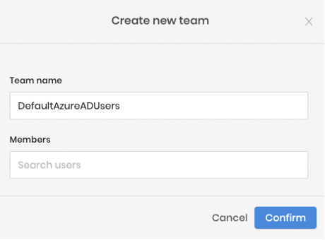

import Tabs from 'shared/components/ui/Tabs';
import WarningBox from 'shared/components/WarningBox';
import InfoBox from 'shared/components/InfoBox';
import PointsOfInterest from 'shared/components/common/PointOfInterest';

# Overview

Single sign-on (SSO) is an authentication method that enables users to log in to multiple applications and websites with one set of credentials. SSO works upon a trust relationship established and maintained between the service provider (SP) and an identity provider (IdP) using certificates.

Spectro Cloud supports the following two types of SSO authentication options:<p></p><br />

   1. **Security Assertion Markup Language (SAML) Based SSO** - You can create a Tenant Cluster Profile with SAML SSO within Palette. This is a manual process that is explained below. <p></p><br />
   2.  **OpenID Connect (OIDC) Based SSO** - You can use OIDC to enable OIDC SSO between Palette and the recommended IdP. It requires application registration to issue a Client ID, Client Secret, and Validation.<p></p><br />

<br />

----

<Tabs>
<Tabs.TabPane tab="SAML BASED SSO" key="saml">

# How to Set Up SAML 2.0-based SSO within Palette

With Spectro Cloud Palette, you can use SAML 2.0 protocols for single sign-on (SSO) authentication using your IdP.

<br />

## Procedure

To set up Spectro Cloud Palette with an identity provider (IdP) SAML based SSO:<p></p><br />
1. Log in to the Palette console as a Tenant Admin.<p></p><br />
2. Select **Tenant Settings** > **SSO Auth Type** > **SAML** to view the SAML panel.<p></p><br />
3. Complete the assertion form with the requested parameters. See below for more details specific to the supported IdPs.<p></p><br />
    The following options will be available for configuring SAML SSO within Palette: <p></p><br />

      - **Service** - Choose your IdP (Azure Active Directory, Okta, Keycloak, OneLogin, ADFS, Other).<p></p><br />
      - **Identity Provider Metadata** - Enter the Identity Provider Metadata.<p></p><br />
      - **Default Teams** - Add the authenticated user's Default Team(s) Palette membership.<p></p><br />
      - **NameID Format** - Choose the appropriate version of the format in use (SAML 1.1, SAML 2.0, email address, other).<p></p><br />

    The following parameters will enable Spectro Cloud Palette as a **Service Provider** (SP) in your IdP. Your IdP will require some or all the information listed below to enable SSO with Palette. <p></p><br />

      - **Single Logout URL** - The IdP will use the logout URL for the SAML SSO configuration.<p></p><br />
      - **EntityId** - https://www.spectrocloud.com<p></p><br />
      - **FirstName** - Attribute in First Name format.<p></p><br />
      - **LastName** - Attribute in Last Name format.<p></p><br />
      - **Email** - Attribute in Email format.<p></p><br />
      - **SpectroTeam** - Attribute in SpectroTeam format.<p></p><br />
      - **Service Provider Metadata** - Provide the EntityDescriptor.<p></p><br />

4. Edit each parameter as necessary and click **Enable** to complete the setup wizard.<p></p><br />

<br />

# Common Identity Providers

## Next Steps

Find the SSO solution with these supported IdPs with Palette.

<br />

----

<Tabs>
<Tabs.TabPane tab="Okta" key="okta">

### Okta

Okta's single sign-on solution can quickly connect and sync to Palette.<p></p><br />

#### References

https://developer.okta.com/docs/guides/build-sso-integration/saml2/before-you-begin/

<br />

</Tabs.TabPane>
<Tabs.TabPane tab="Azure AD" key="azure_ad">

### Azure Active Directory

## Azure Active Directory and SAML-Based Setup


## Enable Single-sign on Procedure

In this example, you'll learn how to integrate Spectro Cloud Palette with Azure Active Directory (Azure AD). When you integrate Spectro Cloud Palette with Azure AD, your users can sign in to Palette using their Azure AD credentials. After configuration, you will be able to: 

- Control in Azure AD who has access to Spectro Cloud Palette.
- Enable your users to automatically sign in to Spectro Cloud Palette with their Azure AD accounts. 
- Manage all Spectro Cloud Palette access in one central location - the Azure AD portal.

## Prerequisites

To configure SSO with Spectro Cloud Palette, you need: 

- An Azure AD user account. If you don't already have one, (you can create an account for free.)[https://azure.microsoft.com/free/?WT.mc_id=A261C142F] 
- Azure AD group for authenticating Palette Tenant Admins
- Azure AD group for authenticating Palette Default Project Viewers
- Spectro Cloud Palette Team to use as a default Team for Azure AD authenticated users
- One of the following roles in Azure AD: Global Administrator, Cloud Application Administrator, Application Administrator, or owner of the service principal. 
- Completion of the steps in (Quickstart: Create and assign a user account[https://learn.microsoft.com/en-us/azure/active-directory/manage-apps/add-application-portal-assign-users]
- A Spectro Cloud Palette Tenant. If you don’t already have one, you can (create an account for free.)[https://www.spectrocloud.com/get-started/]


## How to Set Up Azure AD SAML 2.0-based SSO with Palette

To set up a SAML-based SSO, perform the following steps:<p></p><br />

1.  Go to the **Azure Active Directory Admin Center** and sign in using one of the roles listed in the prerequisites.<p></p><br />

2.  From the sidebar menu, select **Groups**. 

3. The **Groups > All groups** pane opens and displays a list of the existing groups (if any). Create or reuse existing Azure AD groups and populate them with appropriate Azure AD user accounts for access to Palette. Here is an example:

    

    In the above example, we created groups for Palette SSO SAML authentication (palette-* groups), and additionally, for SSO OIDC authentication to Kubernetes Clusters (*-role groups). Later, we will use this information to configure SAML SSO Palette and optionally, OIDC SSO for Kubernetes clusters. <p></p><br />

    Please leave this window open in a separate tab and continue. <p></p><br />

4.  In a separate tab, go to the **Azure Active Directory Admin Center**. In the sidebar menu, select **Enterprise applications**. The **All applications** pane opens and displays a list of the applications in your Azure AD tenant. Search for and select **Azure AD SAML Toolkit 1.**<p></p><br />

    

5. Name the Application how your users should see the application on My Apps.  For Example: 

    Name:  Spectro Cloud Palette - Azure AD SAML Toolkit 

    

6. Click **Create**

7. After Deployment, you should see something like this:

    

8. Select **1.Assign users and groups** section of the left menu.<p></p><br />

9. Select **Add user/group**.<p></p><br />

10. Click **None Selected** under **Users and groups**.<p></p><br />

11. Search for Azure AD ***Users and groups** that you would.<p></p><br />

8. In the **Manage** section of the left menu, select **Single sign-on** to open the **Single sign-on pane** for editing.<p></p><br />

6.  Select **SAML** to open the SSO configuration page.<p></p><br />

7.  Go to the **Set up Azure AD SAML Toolkit 1** section, record the values of the **Login URL**, **Azure AD Identifier**, and **Logout URL** properties to be used later when configuring Spectro Cloud Palette.<p></p><br />

    Here is an example:

    

7.  From within the Azure portal, select **Edit** in the **Basic SAML Configuration** section on the **Set up single sign-on** pane. <p></p><br  />
8.  For **Identifier (Entity ID)**, enter a unique ID that identifies Palette to Azure AD. This value must be unique across all applications in your Azure AD tenant.

    Example: https://test1.console.spectrocloud.com

9.  For **Reply URL (Assertion Consumer Service URL)**, enter the data listed in Spectro Cloud Palette as the *Login URL*.

    Example and screenshot below:

    

    Example: https://console.spectrocloud.com/v1/auth/org/test1/saml/callback

10.  In the **Sign on URL**, enter the information provided in Palette. 

    Example: [https://console.spectrocloud.com/v1/auth/org/test1/saml/callback](https://console.spectrocloud.com/v1/auth/org/test1/saml/callback)

11.  As the Logout URL, optionally enter the information provided in Palette. 

    Example:

    https://console.spectrocloud.com/v1/auth/org/test1/saml/callback


12.  Select **Save**.

13.  In the **SAML Certificates** section, select **Download** for **Federation Metadata XML** to download. Open the file in your favorite editor application, for example, Visual Studio or Notepad.  We will use the data contained in this file to integrate Spectro Cloud Palette in future steps.

14.  Log in to Spectro Cloud Palette as a Tenant Admin.

15.  Select **Tenant Settings** > **Users & Teams** > **Teams **> **+** **Create team**

     We will need to assign a default Team for Azure AD Authenticated Users to join once authenticated.  Please create an appropriately named team with no members for now and select **Confirm**.  Example:

    

     By default, no Roles and privileges are assigned. While users will be successfully authenticated via Azure AD, they are not yet authorized to access Palette resources. To authorize, edit the new Team created above, in our example **DefaultAzureADUsers.**


16.  Add an appropriate Project or Tenant Role or leave blank to configure default access with no privileges for authenticated Azure AD users.

    Here are two examples where authenticated users are assigned by default to the Team **DefaultAzureADUsers**. 

    The first example will provide no privileges by default to authenticated AD users. The second example will assign authenticated users to Project Viewer Role to view the Default Project.


    **No Roles are assigned by default:**

    


    ****Project Viewer Role is assigned by default**
    

    Please note this **Team** is used to first setup SSO with Palette. Later, we will use Azure AD groups synced to Palette with appropriate roles and privileges assigned to Azure AD groups.  For now, setting one default group for Authenticated users is all we need to continue the SSO setup.

17.  In Spectro Cloud Palette, select **Tenant Settings** > **SSO** > **SAML** to view the panel.
18.  Under **Service**, select **Azure Active Directory**.
19.  In the field **Identity Provider Metadata**, paste the contents of the **Azure AD **downloaded **Federation Metadata XML** file.
20.  **Default Teams** – Add the Default Palette Team membership created above. Please note the Team must be created first in Palette.  Example Team: 
21.  **NameID Format** - Choose the appropriate version of the format in use (SAML 1.1, SAML 2.0, email address, other).

Example:

22.  Leave default, edit or copy the following default parameters, which will enable Spectro Cloud Palette as a **Service Provider** (SP) in Azure AD:

* **Single Logout URL** - The IdP will use the logout URL for the SAML SSO configuration.
* **EntityId** - [https://www.spectrocloud.com](https://www.spectrocloud.com/)
* **FirstName** - Attribute in First Name format.
* **LastName** - Attribute in Last Name format.
* **Email** - Attribute in Email format.
* **SpectroTeam** - Attribute in SpectroTeam format.
* **Service Provider Metadata** - Provide the EntityDescriptor.

Edit each parameter as necessary and click **Enable** to complete the setup wizard. If successful, Palette will show a message that “SAML configured successfully”.


23.  In the **Azure portal**, select **Enterprise Applications**, and select the application created in our example: **Azure AD SAML Toolkit.**
24.  Select **Users and groups **in the sidebar.
25.  Click **None Selected**.


Search for Azure AD **Users and groups** you would like to use for access Spectro Cloud Palette. Click each User and Group after searching. When finished, click **Select** to enable **those Users and groups** to access Palette.


## Results
You have now integrated Spectro Cloud Palette with Azure Active Directory (Azure AD). 

 
#### References

https://docs.microsoft.com/en-us/azure/active-directory/manage-apps/add-application-portal-setup-sso

</Tabs.TabPane>

<Tabs.TabPane tab="KeyCloak" key="keycloak">

### KeyCloak

#### References

https://www.keycloak.org/docs/latest/server_admin/#saml-clients

</Tabs.TabPane>
<Tabs.TabPane tab="OneLogin" key="onelogin">

### OneLogin

#### References

https://developers.onelogin.com/saml/app-catalog

</Tabs.TabPane>
<Tabs.TabPane tab="ADFS" key="msft_adfs">

### Microsoft AD FS

#### References

https://docs.microsoft.com/en-us/azure/active-directory/hybrid/how-to-connect-fed-saml-idp

</Tabs.TabPane>
</Tabs>
</Tabs.TabPane>
<Tabs.TabPane tab="OIDC BASED SSO" key="oidc">

# How to Set Up OIDC-based SSO within Palette

Spectro Cloud Palette supports OpenID Connect (OIDC), a de facto standard of contemporary authentication that provides secured identity management in a highly interoperable format.<p></p><br />

## Procedure

To set up an OIDC-based SSO in Spectro Cloud Palette perform the following steps:<p></p><br />

1. Log in to the Palette console as the Tenant Admin. <p></p><br />
2. Select the **Tenant Settings** > **SSO** > **OIDC** to view the panel.<p></p><br />
3. Enable Spectro Cloud as the **Service Provider** by completing the form with the following parameters. Select the tabs below for more details specific to IdPs supported with Palette.<p></p><br />

   * **Issuer URL** - The URL of the OpenID identity provider.<br /> **Note**: For AWS users, Issuer URL needs to be generated in the format as described below: <p></p><br />
	`https://cognito-idp.[REGION].amazonaws.com/[USER-POOL-ID]` <p></p><br />

   - **Client ID** - The ID for the client application that makes authentication requests.<p></p><br />
   - **Client Secret** - Enter the secret created by the IdP.<p></p><br />
   - **Default Teams** - The Default Palette Team(s) to which authenticated members are assigned automatically.<p></p><br />
   - **Scopes** - The user's details will be used as part of SSO, like *email*, *firstname*, *lastname* or *groups*. Each scope returns a set of user attributes, called claims. <p></p><br />Microsoft Azure AD Example: "openid, profile, email, allatclaims"<p></p><br />
   - **REQUIRED CLAIMS** - These are the parameter values, claimed by the user, to be mapped with the Identity Provider Platform. Complete the Required Claims:<p></p><br />
     - **Email** - Azure AD Example: "email"<p></p><br />
     - **First Name** - Azure AD Example: "given_name"<p></p><br />
     - **Last Name** - Azure AD Example: "family_name"<p></p><br />
     - **Spectro Team Name** - Azure AD Example: "groups". <p></p><br />Any non-admin user that is added to a Tenant, must be added to at least one Team. This Team can be changed later if needed. See the [Teams](/glossary-all#team) section for more details on Teams.<p></p><br />

          - If a user is not added to a Team, the user can still log in successfully but will not be able to see the console until proper Project or Tenant permissions are applied (Tenant Admin, Project Admin, Project Viewer, and so on). The **SpectroTeam** attribute carries forward the available team(s) for the user being authorized. This gives the administrator the flexibility to grant access to Spectro Cloud Palette using either Users or Groups in their IdP or by adding users directly to a Palette Team(s).<p></p><br />

          - The values of the **SpectroTeam** parameter is case-sensitive, so the Tenant Admin should ensure that the team names are identical on both consoles. To sync an IdP group with a Palette Team, ensure the IdP group Name (or if it's Azure Active Directory, use the Object Id corresponding to the IdP group Name) matches the Palette Team name.<p></p><br />

          - A use case example can be where a new member is to be added to the Palette Tenant by the Tenant Admin. The administrator can configure a default Palette Team or a synced IdP group that is common to all authenticated users. This default Palette Team/IdP group can be applied to the Palette SAML Panel as a one-time setting.<p></p><br />

<InfoBox>
Your IdP may require the following settings to configure OIDC SSO with Palette:

  - **Callback URL** - The URL to which Auth0 redirects users after they authenticate. Ensure that this value is configured for the application you registered with the OIDC Identity Provider.

  - **Logout URL** - The IdP will use the logout URL for the OIDC SSO configuration.

</InfoBox>

## Results
You have now established the minimum configuration that is required to configure Palette OIDC, capable of communicating with other IdPs configured as OpenID Connect Providers.

<br />

# Recommended Identity Providers

-----

<br />

<Tabs>
<Tabs.TabPane tab="Okta" key="okta">

## Okta

#### References

https://developer.okta.com/docs/guides/build-sso-integration/openidconnect/before-you-begin/

</Tabs.TabPane>
<Tabs.TabPane tab="Azure AD" key="azure_ad">

## Azure Active Directory

After configuration, your organization can integrate Microsoft Azure Active Directory to authenticate access to Spectro Cloud Palette.

## Prerequisites

- Microsoft Azure Active Directory with appropriate permissions to create and modify users, groups, Enterprise Applications (SAML) or App Registrations (OIDC).<p></p><br />
- Access to Palette - Request access for a [Free Trial](/getting-started/palette-freemium).<p></p><br />
- Appropriate rights and [enabled token IDs](https://docs.microsoft.com/en-us/azure/active-directory/develop/v2-protocols-oidc#enable-id-tokens) in Azure.<p></p><br />
- [kubelogin](https://github.com/int128/kubelogin) - This is a `kubectl` plugin for Kubernetes OpenID Connect (OIDC) authentication, also known as `kubectl` oidc-login.

<br />

<center> Kubelogin Architecture</center>

  <br />

 

<br />

## Steps for OIDC Integration in Microsoft Azure Active Directory

From within Microsoft Azure AD, log in and find the Azure Active Directory service page. The following two libraries contain the necessary parameters to configure Palette.

<br />

1. **App registrations** - You will use Azure AD App registrations to configure OIDC SSO with Spectro Cloud Palette. <p></p><br />

2. **Enterprise applications** - You will use Azure AD Enterprise registrations to configure SAML SSO with Spectro Cloud Palette. <p></p><br />


<p></p>

## Integrating OIDC SSO for authenticating access to Kubernetes clusters using Microsoft Azure Active Directory

This section describes how to enable Azure AD SSO authentication to access a Kubernetes cluster.

1. From the sidebar menu, select **Tenant Settings** and ensure the **Tenant Admin** from dropdown is selected.<p></p><br />
2. Go to **Profiles** from within Tenant Admin or a Project and select an existing Cluster Profile. Alternatively, if a Cluster Profile does not exist, create a new Cluster Profile with a CNCF Kubernetes distribution. Once you select a profile, you will see the Infrastructure layers in the picture.<p></p><br />
3. Choose the **Kubernetes** layer and select the **Pack Values** to modify.<p></p><br />
4. The Pack Version Settings are exposed with the appropriate privileges (Tenant Admin). Notate the following **Variable** within the pack settings.<p></p><br />

## Configuring the Application OpenID Configuration in the Cluster

1.  Go to the **Kubeadminconfig**:**apiServer**:**extraArgs** section of the pack layer. <p></p><br />

    - **oidc-groups-claim** - "Groups"<p></p><br />
    - **oidc-username-claim** - "Email"<p></p><br />
    - **oidc-issuer-url** -  "Issuer's URL"<p></p><br />
    - **oidc-client-id** - "Client ID"<p></p><br />

       

<p></p><br />

2.  Next, find the **clientConfig** section and modify the following parameters:<p></p><br />

    - **oidc-issuer-url** - This is the provider URL which allows the Palette to discover public signing keys.<p></p><br />
    - **oid-client-id** - The client ID is found under the Application Registration/Enterprise Application.<p></p><br />
    - **oidc-client-secret** - The secret provided by Azure AD.<p></p><br />
    - **oidc-extra-scope** - The scope tags.<p></p><br />


<p></p><br />

## Binding the Cluster Admin Role AD to Cluster Admin via RBAC

Configure the Role Based Access Control Pack (RBAC).<p></p><br />

### Adding an RBAC Pack

1. Under **Tenant Admin**, create an **RBAC Cluster** profile. <p></p><br />
2. Go to **Cluster Profile** > +**Add Cluster Profile** and complete the Basic Information.<p></p><br />
3. Enter the **Name**, **Version**, and **Description** (Optional) and click **Next**. <p></p><br />
4. Under **Type**, select **+Add-on New Pack**.<p></p><br />
5. Select **Authentication** as the Pack Type.<p></p><br />
6. From the **Registry** dropdown, click **Public Repo**.<p></p><br />
7. Choose **Spectro RBAC** as the Pack Name.<p></p><br />
8. Select the Pack Version.<p></p><br />
9. Click the **spectro-rbac 1.0.0** Pack Values to edit the pack layer settings.<p></p>
   **Note**: This is where you will edit the role settings.<p></p><br />
10. Click the **Confirm & Create** button.<p></p><br />

### Editing the RBAC Cluster Profile

1. From Palette, go to **Profiles** and choose the **RBAC** cluster profile.<p></p><br />
2. Click the layer image and specify the ClusterRoleBindings.<p></p><br />
3. Go to the **clusterRoleBindings**:**role** section and type **cluster-admin**.<p></p><br />
4. Change the settings to your requirements and specific groups.<p></p><br />

For Azure AD integration with RBAC, edit your RBAC pack value to below. Or, copy and paste the entire block to your RBAC pack and modify you inputs where appropriate:

```yml
pack:
  spectrocloud.com/install-priority: "0"
charts:
  spectro-rbac:
    # Specify one or more ClusterRoleBinding
    # Note that the _name_ attribute is optional
    clusterRoleBindings:
      - role: cluster-admin
        name: bind-cluster-admin-role-to-cluster-admin
        subjects:
          #- type: User
            #name: user5
          - type: Group
          # For "name", input the Azure AD Group ID name and add a comment on what the Azure AD displayname is that corresponds to the Azure AD Group Name
          # Example: Azure AD Group Object Id "70d19fd6-####-####-####-##c6c915e301" is tied to the Azure AD Security Group with the display name of "cluster-admin-role".
          # name: "AZURE AD GROUP ID NAME"
            name: "INSERT AZURE AD GROUP ID For Cluster Admins"
      - role: admin
        name: bind-admin-role-to-admin
        subjects:
          #- type: User
            #name: user5
          - type: Group
          # For "name", input the Azure AD Group ID name and add a comment on what the Azure AD displayname is that corresponds to the Azure AD Group Name
          # Example: Azure AD Group Object Id "064f2e40-####-####-####-##b9f7927976" is tied to the Azure AD Security Group with the display name of "admin-role".
          # name: "AZURE AD GROUP ID NAME"
            name: "INSERT AZURE AD GROUP ID For Admins"
      - role: view
        name: bind-view-role-to-view
        subjects:
          #- type: User
            #name: user6
          - type: Group
          # For "name", input the Azure AD Group ID name and add a comment on what the Azure AD displayname is that corresponds to the Azure AD Group Name
          # Example: Azure AD Group Object Id "732edc96--####-####-####-##851dee3380" is tied to the Azure AD Security Group with the display name of "view-role".
          # name: "AZURE AD GROUP ID NAME"
            name: "INSERT AZURE AD GROUP ID For Viewers"
          #- type: ServiceAccount
            #name: group6
            #namespace: foo
      - role: edit
        name: bind-edit-role-to-edit
        subjects:
          #- type: User
            #name: user6
          - type: Group
          # For "name", input the Azure AD Group ID name and add a comment on what the Azure AD displayname is that corresponds to the Azure AD Group Name
          # Example: Azure AD Group Object Id "21b55c08-6-####-####-####-##a3e2245ad7" is tied to the Azure AD Security Group with the display name of "edit-role".
          # name: "AZURE AD GROUP ID NAME"
            name: "INSERT AZURE AD GROUP ID For Edit"
          #- type: ServiceAccount
            #name: group6
            #namespace: foo
    #namespaces:
      # Specify one or more RoleBindings
      #- namespace: team1
        #createNamespace: true
        #roleBindings:
          #- role: admin
            #name: special-override-name-admin-role
            #kind: ClusterRole
            #subjects:
              #- type: User
                #name: user3
              #- type: Group
                #name: team1namespaceadmin
          #- role: view
            #kind: ClusterRole
            #subjects:
              #- type: User
                #name: user4
              #- type: Group
                #name: team1namespaceview
      #- namespace: team2
        #createNamespace: true
        #roleBindings:
          #- role: admin
            #name: special
            #kind: ClusterRole
            #subjects:
              #- type: User
                #name: user1
              #- type: Group
                #name: group1
```

**Example**:

**Azure AD Group Object ID** "70\*\*\*\*\*\*\-355a-453b-aadf-\*\*\*\*\*\*\*\*\*301" is linked to the **Azure AD Security Group** with the display name of **cluster-admin-role**.

**name**: "AZURE AD GROUP ID NAME"


## Results

You have now established SSO authentication integrating Microsoft Azure AD and Spectro Cloud Palette using OIDC.

## References

[Microsoft Active Directory](https://docs.microsoft.com/en-us/azure/active-directory/develop/v2-protocols-oidc) <br />
[Credential Plugin Diagram](https://github.com/int128/kubelogin/raw/master/docs/credential-plugin-diagram.svg)<br />
[kubelogin](https://github.com/int128/kubelogin)<br />

<br />
<br />

</Tabs.TabPane>

<Tabs.TabPane tab="KeyCloak" key="keycloak">

### KeyCloak

#### References

https://www.keycloak.org/docs/latest/server_admin/#_oidc

</Tabs.TabPane>

<Tabs.TabPane tab="OneLogin" key="onelogin">

### OneLogin

#### References

https://developers.onelogin.com/openid-connect

</Tabs.TabPane>

<Tabs.TabPane tab="AD FS" key="msft_adfs">

### Microsoft ADFS

#### References


https://docs.microsoft.com/en-us/windows-server/identity/ad-fs/development/ad-fs-openid-connect-oauth-concepts

</Tabs.TabPane>

</Tabs>


</Tabs.TabPane>
</Tabs>
